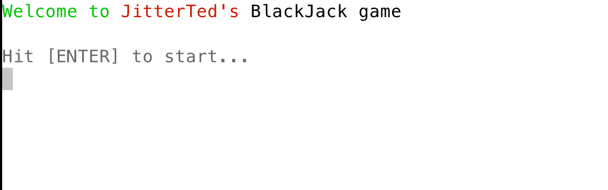
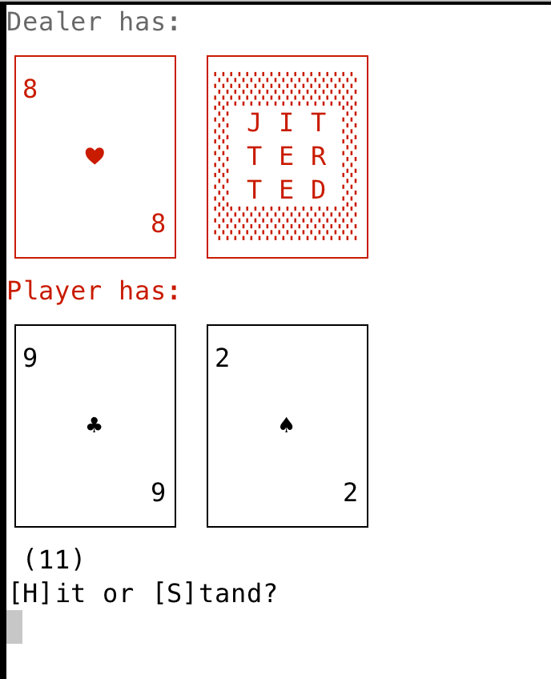

# Refactoring (Blackjack) to Hexagonal Architecture

This is the starter code base for the "Refactoring to Hexagonal Architecture"
course.

# Requirements

You **must have** the following already set up and running on your machine:

* Java 17 (or later)
    * Ensure that this is the default Java runtime by typing `java -version`
      and you should see something like:
      ```
      openjdk version "17.0.4.1" 2022-08-12
      ```
* git 2.23 (or later)
* IntelliJ IDEA 2021.2 (or later) _Community_ or _Ultimate_ Editions
    * or Eclipse (if you must, though all course examples will use IntelliJ IDEA)

# Setting Up the Project

Before opening up the project using your development environment,
make sure that you can build the project from the command-line by running:

### macOS/Linux:
```sh
./mvnw clean test
```

### Windows

```cmd
mvnw clean test
```

Once the project compiles from the command-line, open it in your development
environment and ensure that you can run all of the unit tests -- if everything
is set up properly, they will all pass.

## Running and Playing the Game

To run the game, it works best if you run it in a real terminal window and not
inside the IDE (which may not recognize the "ANSI" messages used to change
colors and move the cursor around). To do this, use Maven to build and package
the JAR and then you can run it:

### macOS/Linux:
```sh
./mvnw clean package
```

### Windows

```cmd
mvnw clean package
```

This will download dependencies, compile the code, run the tests, and then
package it into a JAR file that it will put in the `target` directory.
To run it, do the following at the command-line in the project's directory:

### macOS/Linux:

```sh
java -jar target/blackjack-1.0.2.jar
```

### Windows

```
java -jar target\blackjack-1.0.2.jar
```

# The Game of Blackjack

When running in the terminal, the game will look something like this:



followed by the game itself, which starts with the "initial deal" of two cards
each to the Dealer (top row) and you, the Player (bottom row):



## Rules of Blackjack

Players play against the Dealer, not each other. The goal of the game is to get
a hand with a score as close to 21 without going over, as well as beating the
score of the Dealer's hand. The score of the hand is the sum of the point
values of its cards. If a Player's hand score is over 21, the Player loses
("busts").

Blackjack uses a standard deck of 52 playing cards. Each card has a rank:
Ace (A), 2, 3, 4, 5, 6, 7, 8, 9, 10, Jack (J), Queen (Q), or King (K).
The card's rank determines its scoring value: numbered cards 2-10 are worth
their number; face cards (Jack, Queen, King) are worth 10 points; Aces are
worth 1 point or 11 points, whichever would bring the hand value closer to
21 without exceeding it.

Each round proceeds as follows:

### Initial Deal

* The dealer shuffles the deck and deals two cards "face up" (with the Rank and
  Suit of the card showing) to each player. The dealer deals their cards with
  one card "face down" (with only the back showing, known as a "hole" card)
  and one card "face up".

### Player's Turn

* The dealer asks the first player whether they want to "hit" (get another
  card from the deck) or "stand" (not get any more cards).
* If they choose to stand, their turn is over and the game moves on to the next
  player, if any. If not, it's the dealer's turn.
* If the player hits, the dealer deals them a card from the deck, face up, and
  their hand score changes based on the additional card.
* If this causes their score to go over 21, they have "busted" and immediately
  lose the round and play continues with the next player.
* If they haven't busted, they continue to have the option to hit or stand
  again.

### Dealer's Turn

Once all players have either busted or stood, it's the dealer's turn to play.
They turn their face-down card over so the card's Rank and Suit are shown.
They then hit until their score is 17 or higher at which point they must stand.
The dealer cannot decide to hit or stand, if their hand's score is 16 or lower,
they must hit, and at 17 or higher, they must stand.

If the dealer busts, any players who did not bust earlier automatically win the
round. Otherwise, each player wins if they have a strictly higher score than
the dealer, or loses if they have a strictly lower score, and "pushes" (ties)
if they have the same score.
